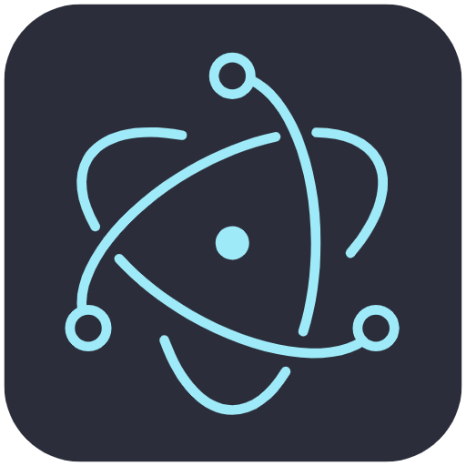
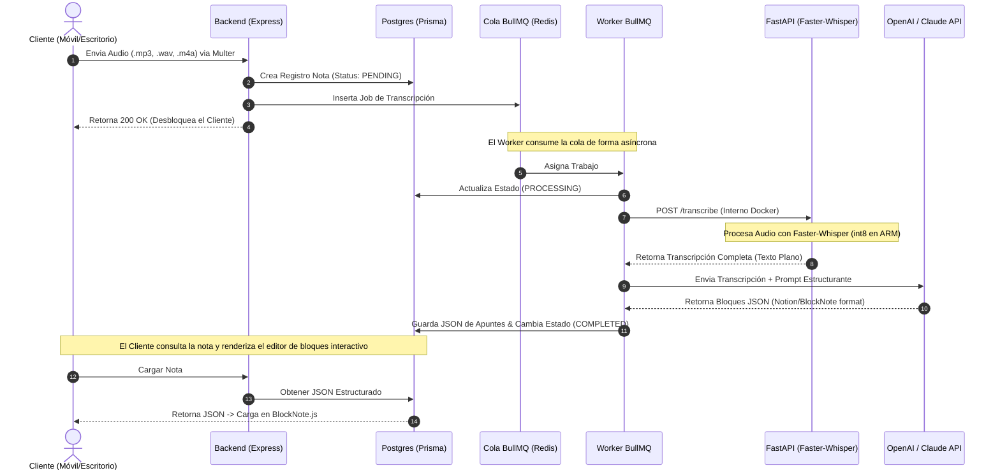

# 📝 PostNotes

<p align="center">
  
</p>

<p align="center">
  <strong>El asistente personal definitivo de toma de apuntes para estudiantes.</strong><br />
  Graba tus clases o reuniones, transcríbelas de forma local y offline, y estructúralas en apuntes interactivos estilo Notion gracias a Inteligencia Artificial.
</p>

<p align="center">
  
  
  
  
</p>

---

## 🚀 Descripción del Proyecto

**PostNotes** es una plataforma autohospedada (*self-hosted* / *on-demand*) diseñada específicamente para capturar largas sesiones de audio (como clases universitarias de hasta 90 minutos), transcribirlas localmente de forma gratuita y procesarlas inteligentemente para generar apuntes ricos, estructurados, resumidos y con listas de tareas en formato de **editor de bloques interactivo (estilo Notion/BlockNote)**.

El sistema fue diseñado por **kovac** (Estudiante de Ingeniería Civil en Informática y Telecomunicaciones de la Universidad Diego Portales) para ser desarrollado en un entorno de **Arch Linux (Hyprland)** y desplegado en producción en la capa **Always Free de Oracle Cloud Infrastructure (OCI)** sobre una instancia Ampere ARM64 VM.Standard.A1.Flex (4 vCPUs, 24 GB RAM).

---

## 🛠️ Arquitectura y Flujo de Trabajo (Job Queue Pattern)

El backend implementa un patrón robusto de **Cola de Tareas Asíncronas** para procesar archivos de audio masivos sin bloquear la experiencia de usuario en las aplicaciones cliente.



### Características Clave del Flujo:
1. **Comunicación Aislada:** El microservicio de Python (`FastAPI`) que ejecuta el modelo de transcripción no expone ningún puerto al exterior. Está encapsulado dentro de la red virtual de Docker y se comunica únicamente de forma interna con el **Worker de BullMQ**.
2. **Optimización ARM64:** El microservicio de transcripción está optimizado para ejecutarse en CPUs ARM64 Ampere utilizando `faster-whisper` con el tipo de cómputo `int8` y subprocesamiento dinámico mediante hilos ajustables (`WHISPER_CPU_THREADS`).
3. **Resiliencia de Procesamiento:** Los trabajos de procesamiento de audio toleran cortes y tienen timeouts configurados de hasta **30 minutos** para soportar grabaciones de clases enteras.

---

## 🧰 Stack Tecnológico

| Componente | Tecnologías Utilizadas |
| :--- | :--- |
| **Escritorio** | [Electron](https://www.electronjs.org/) + [React](https://react.dev/) + [Vite](https://vitejs.dev/) + [TypeScript](https://www.typescriptlang.org/) |
| **Editor de Notas** | [BlockNote.js](https://www.blocknotejs.org/) (Editor de bloques interactivo con estructura JSON) |
| **Backend API** | [Node.js](https://nodejs.org/) + [Express](https://expressjs.com/) + [TypeScript](https://www.typescriptlang.org/) |
| **Base de Datos** | [PostgreSQL](https://www.postgresql.org/) gestionado con [Prisma ORM](https://www.prisma.io/) |
| **Cola de Trabajo** | [BullMQ](https://bullmq.io/) + [Redis](https://redis.io/) |
| **Motor Transcriptor** | [FastAPI](https://fastapi.tiangolo.com/) + [Faster-Whisper](https://github.com/SYSTRAN/faster-whisper) (Modelos Whisper de OpenAI optimizados con CTranslate2) + [FFmpeg](https://ffmpeg.org/) |
| **Orquestación** | [Docker](https://www.docker.com/) & [Docker Compose](https://docs.docker.com/compose/) |

---

## 📁 Estructura del Proyecto

```text
PostNotes/
├── backend/              # API REST en Express y Worker de BullMQ (TypeScript)
│   ├── prisma/           # Esquema de base de datos PostgreSQL
│   ├── src/              # Controladores, rutas, lógica de cola y tareas
│   └── Dockerfile        # Dockerfile optimizado (Multi-stage build)
├── transcriber/          # Microservicio de IA local (FastAPI / Python)
│   ├── main.py           # Endpoint de transcripción con Faster-Whisper
│   ├── requirements.txt  # Librerías de Python (faster-whisper, fastapi, etc.)
│   └── Dockerfile        # Dockerfile para ARM64/x86 con instalación de FFmpeg
├── desktop/              # Aplicación de escritorio multiplataforma (Electron + React)
│   ├── src/              # Código fuente de Electron (Main, Preload, Renderer)
│   └── package.json      # Dependencias y scripts de construcción local
├── docker-compose.yml    # Orquestación de toda la infraestructura backend
└── .env.example          # Plantilla de variables de entorno configurables
```

---

## ⚙️ Configuración e Instalación

### 📦 Prerrequisitos
* Tener instalado **Docker** y **Docker Compose** en tu máquina de desarrollo o servidor OCI.
* Tener instalado **Node.js** (v18+) para la aplicación de escritorio.

---

### 1️⃣ Configuración de Variables de Entorno

Copia la plantilla de variables de entorno en la raíz del proyecto:
```bash
cp .env.example .env
```

Edita el archivo `.env` e introduce tus credenciales:
```env
# Base de Datos
DB_USER=postnotes
DB_PASSWORD=una_contrasenia_segura
DB_NAME=postnotes

# API Keys para estructurar las notas en bloques (Notion Style)
OPENAI_API_KEY=tu_openai_api_key

# Optimización en ARM64 / Multi-Core
WHISPER_CPU_THREADS=4  # Hilos de ejecución del CPU (4 es ideal para OCI A1.Flex)
WHISPER_NUM_WORKERS=1  # Número de workers concurrentes para Whisper
```

---

### 2️⃣ Levantamiento de la Infraestructura (Backend y Servicios)

Toda la infraestructura (API, base de datos, caché de Redis, worker y transcriptor de inteligencia artificial) se levanta con un único comando:

```bash
docker-compose up -d --build
```

Esto levantará los siguientes servicios:
* **`postgres`**: Base de datos relacional para guardar notas, usuarios y bloques JSON.
* **`redis`**: Sistema de mensajería rápido para gestionar las colas de BullMQ.
* **`transcriber`**: Microservicio FastAPI aislado para transcribir audios localmente.
* **`backend-api`**: Servidor Express que atiende las solicitudes de la app móvil y escritorio.
* **`backend-worker`**: Consumidor BullMQ que coordina la transcripción y las llamadas a la API de LLM.

#### Inicializar la base de datos (Migraciones de Prisma)
Una vez arriba los contenedores, debes aplicar las migraciones de base de datos para generar las tablas correspondientes en PostgreSQL:

```bash
docker-compose exec backend-api npx prisma migrate deploy
```

---

### 3️⃣ Ejecutar la Aplicación de Escritorio (Desktop)

Para ejecutar la aplicación de escritorio localmente en tu sistema Arch Linux u otro SO:

1. Entra a la carpeta de escritorio:
   ```bash
   cd desktop
   ```
2. Instala las dependencias:
   ```bash
   npm install
   ```
3. Inicia la aplicación en modo desarrollo:
   ```bash
   npm run dev
   ```

*Nota: La aplicación de escritorio se conectará automáticamente al backend levantado en Docker localmente para guardar y renderizar tus notas interactivas a través de **BlockNote.js**.*

---

## ⚡ Despliegue en Producción (Oracle Cloud - ARM64)

El proyecto está 100% optimizado para la capa Always Free Ampere de OCI. Los Dockerfiles incluidos realizan compilaciones específicas optimizadas para arquitecturas `aarch64` (ARM64).

* **Consumo de Memoria:** Gracias al uso de `faster-whisper` compilado sobre CTranslate2 con `compute_type="int8"`, el uso de memoria RAM e impacto térmico del procesador se reduce drásticamente, permitiendo que la instancia de 24 GB de OCI maneje múltiples tareas en paralelo holgadamente.
* **Seguridad:** El contenedor transcriptor no tiene puertos abiertos al host externo (`ports` omitido en compose), lo que asegura que tu motor de inteligencia artificial no sea expuesto a la red pública.
