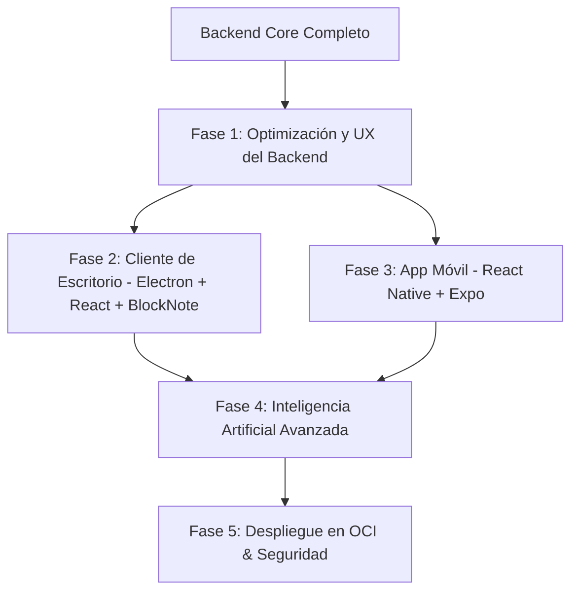

# PostNotes: Hoja de Ruta (Roadmap) del Proyecto 🚀

¡Felicidades! La infraestructura principal (Backend Express + Redis + Queue + FastAPI transcriber + PostgreSQL con Prisma) ya está funcionando y procesando audios largos de manera asíncrona de forma estable.

Dado que el motor de procesamiento ya es robusto, los siguientes pasos lógicos se dividen en **cinco fases estratégicas** para convertir este backend en un ecosistema de productividad personal premium y completo.

---

## 🗺️ Fases del Proyecto

---

### ⚡ Fase 1: Optimización del Backend y UX (El Siguiente Paso Natural)

Antes de construir interfaces complejas, es ideal pulir la comunicación del backend y la velocidad del transcritor.

1. **Notificaciones en Tiempo Real (WebSockets / SSE)**:
   * **Problema actual**: El cliente tiene que realizar *polling* constante a `/api/jobs/:id` para saber si la transcripción terminó.
   * **Solución**: Implementar **Server-Sent Events (SSE)** o **WebSockets (Socket.io)** para notificar en tiempo real al frontend el progreso del trabajo (`PENDING` ➡️ `PROCESSING` ➡️ `COMPLETED`/`FAILED`).
2. **Opción Híbrida de Transcripción (Local vs. API)**:
   * **Problema actual**: La transcripción local de 90 minutos de audio en CPU ARM tarda un tiempo considerable.
   * **Solución**: Permitir seleccionar la fuente de transcripción:
     * **Local (Gratis)**: Sigue usando `faster-whisper` en el contenedor de FastAPI (ideal para cuando no tienes prisa).
     * **Remota (Ultra Rápida)**: Agregar soporte para la API de **Groq Whisper** (súper veloz y económica/gratuita en sus tiers actuales) o **OpenAI Whisper** para procesar audios de 90 min en menos de 1 minuto cuando se requiera inmediatez.
3. **Optimización de Faster-Whisper en ARM**:
   * Ajustar los parámetros de CPU en FastAPI (`cpu_threads`, `num_workers`) para exprimir al máximo los 4 vCPUs de la instancia ARM A1.Flex de Oracle Cloud.
4. **Limpieza Automática de Almacenamiento**:
   * Asegurar que el archivo de audio subido se borre inmediatamente después de completarse la transcripción (`DELETE_AUDIO_AFTER_COMPLETION=true`), evitando agotar el almacenamiento de la instancia (200GB gratuitos en OCI).

---

### 💻 Fase 2: Cliente de Escritorio para Arch Linux (Electron + React + Vite)

Para tu entorno Arch Linux con Hyprland, una aplicación de escritorio fluida, hermosa y con atajos de teclado rápidos es clave.

1. **Editor de Bloques Estilo Notion (BlockNote.js)**:
   * Implementar **BlockNote.js** en React.
   * Leer el JSON estructurado por el LLM desde Postgres y cargarlo directamente en el editor.
   * Guardar los cambios en tiempo real en la base de datos a medida que editas tus apuntes.
2. **Diseño Premium y Oscuro (Glassmorphism & Micro-animations)**:
   * Interfaz fluida y minimalista, adaptada perfectamente al ecosistema Hyprland.
   * Barra lateral para organizar notas por categorías, asignaturas de la universidad o etiquetas.
   * Panel de control de transcripciones activas con barras de progreso animadas.

---

### 📱 Fase 3: Aplicación Móvil (React Native + Expo)

El origen de todo: la herramienta para capturar el conocimiento en el aula.

1. **Grabación Robusta en Segundo Plano**:
   * Configurar servicios nativos para evitar que Android o iOS congelen la aplicación si bloqueas la pantalla o abres otra app mientras grabas la clase de 90 minutos.
2. **Compresión Local de Audio**:
   * Comprimir el audio antes de enviarlo (por ejemplo, a formato AAC / M4A) para reducir significativamente el peso del archivo, ahorrar datos de subida y acelerar el envío HTTP al backend.
3. **Flujo de Carga Directo**:
   * Pantalla simple con un botón gigante de grabación, temporizador, visor de forma de onda (*waveform*) y lista de subidas recientes.

---

### 🧠 Fase 4: Inteligencia Artificial Avanzada (Personalización y Chat)

Llevar la interacción con tus notas a otro nivel.

1. **Plantillas de Estructuración Personalizadas**:
   * Poder elegir el formato de salida del LLM según el tipo de clase/reunión:
     * **Apuntes de Estudio**: Definiciones, fórmulas, jerarquías lógicas claras y tareas de repaso.
     * **Minuta Corporativa / Reuniones**: Acuerdos, tareas asignadas, fechas límite y resumen ejecutivo.
     * **Modo Flashcards / Cuestionario**: Generación automática de preguntas y respuestas para estudiar activamente.
2. **Chat Inteligente con la Nota ("Talk to your class")**:
   * Integrar una interfaz de chat interactiva al lado del editor BlockNote.
   * Preguntarle al LLM dudas específicas como: *"¿Qué fórmula usó el profesor para explicar X en el minuto 40?"* o *"Explícame con peras y manzanas el segundo punto del apunte"*.

---

### 🛡️ Fase 5: Despliegue Seguro en Oracle Cloud (OCI)

Pasar el entorno local a producción en la nube Always Free de Oracle.

1. **Autenticación y Seguridad**:
   * Proteger el backend con JWT o configurar un proveedor ligero de Auth.
   * Proteger los endpoints de subida para que nadie más pueda saturar tu servidor.
2. **Proxy Inverso con SSL**:
   * Configurar **Caddy** o **Nginx** con HTTPS automático (Let's Encrypt) para asegurar las subidas de audio y la comunicación de datos.
3. **Monitoreo de Recursos**:
   * Dashboard ligero en el backend (o integración con BullMQ Board) para monitorear el estado de la cola Redis y el uso de memoria de Faster-Whisper.
